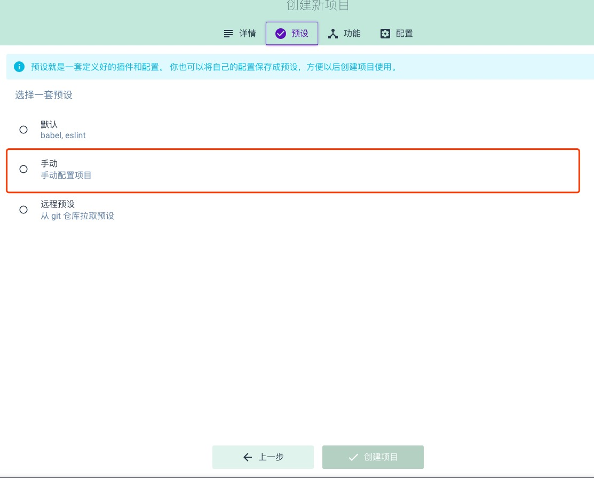
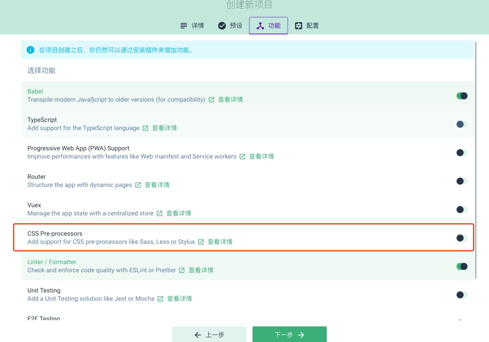
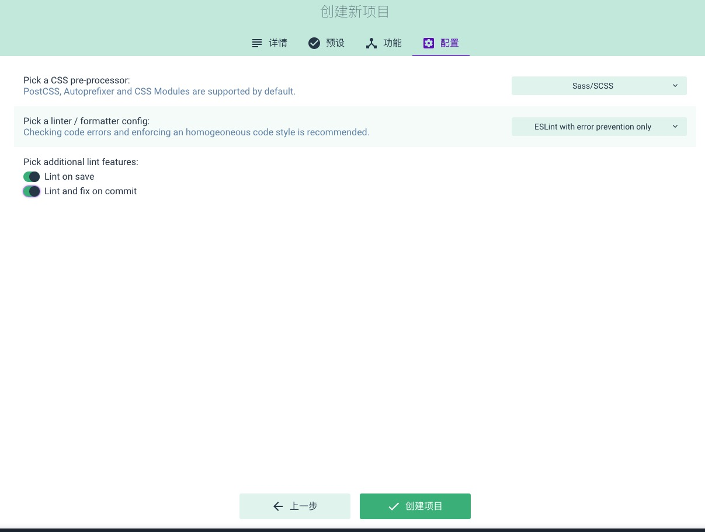
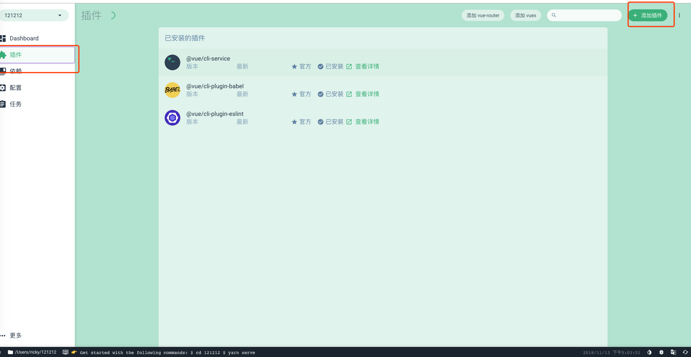
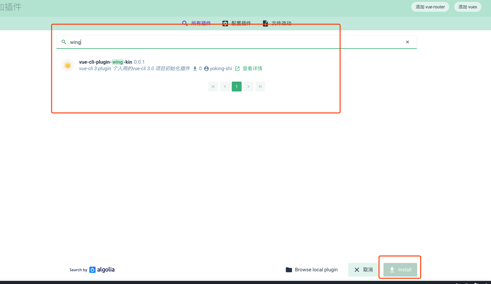
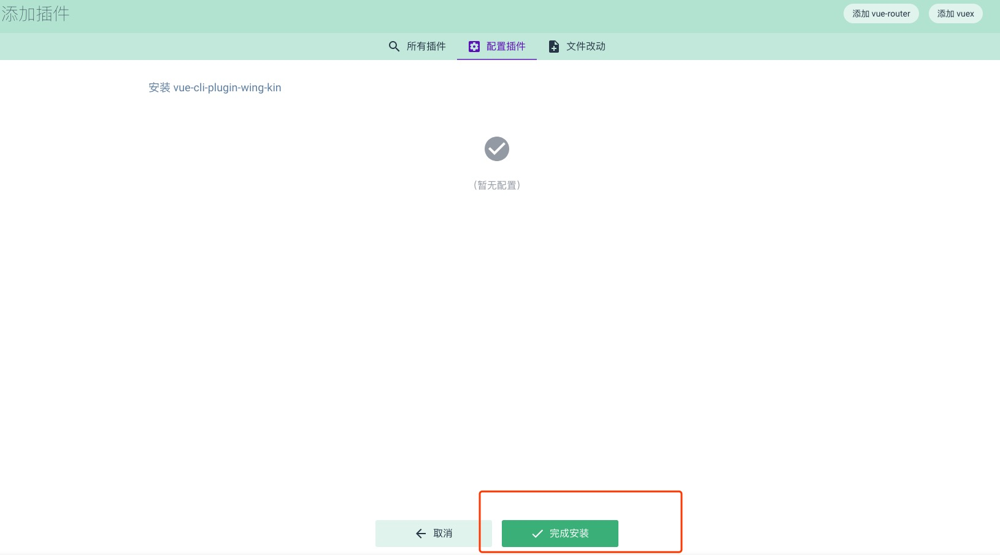
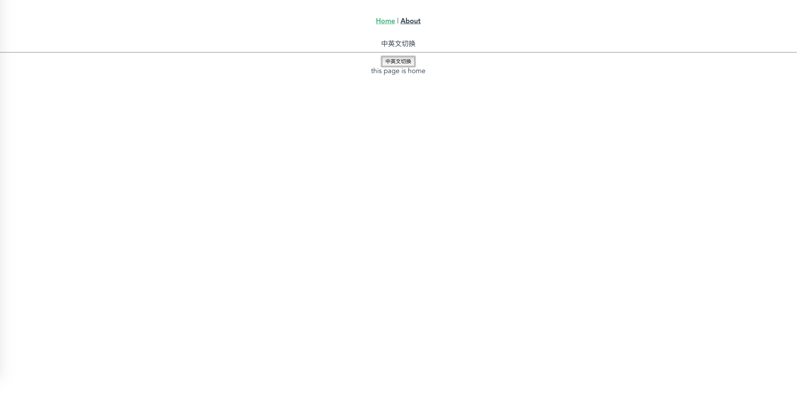
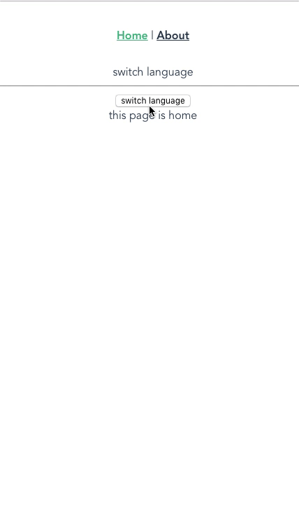

# vue-cli-plugin-wing-kin
这个是基于vue-cli 3.0 开发的个人项目初始化插件，所以可能在创建的时候需要按照配置步骤。

###  1.创建项目
先开启vue-cli的ui界面

```shell
vue ui
```

### 2. 然后进行如下配置
- 预设中选择手动配置
- vue-router 跟 vuex 暂时不用勾选，其他随意
- 然后创建项目
- 界面出来之后，到插件界面，点击添加插件，输入wing-kin搜索到插件，然后安装









### 3. 开启服务
```shell
yarn serve
```
或者到任务界面开启serve


## 插件内容介绍
插件自动加入的文件目录
```shell
src
├── App.vue // 
├── api // api列表 所有的api可以按照模块进行划分
│   ├── app.js
│   └── index.js
├── assets
│   └── logo.png
├── common // 一些公用方法
│   ├── filter.js
│   ├── http.js
│   └── util.js
├── components // 组件目录
│   ├── HelloWorld.vue
│   └── index.js
├── i18n // 国际化语言目录
│   ├── index.js
│   └── locales
│       ├── en.yaml
│       └── zh.yaml
├── main.js // 入口文件
├── router // 路由目录
│   └── index.js
├── store // vuex目录
│   ├── index.js
│   ├── modules
│   │   └── app.js
│   └── types.js
└── views // 页面目录
    ├── about.vue
    └── home.vue
```

### TODO
- 添加各个部分的介绍